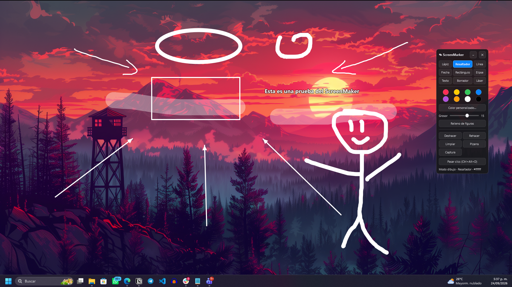

# ScreenMarker

ScreenMarker is free and open-source software that lets teachers draw, highlight, point, and write directly over any application on their screen. It is designed to support virtual and remote classes by making explanations clearer while the teacher shares a browser, presentation, PDF, terminal, video call, or any other window.

ScreenMarker runs on **Linux** and **Windows** and is built with Python and Qt (PySide6).



## Objective

The objective of ScreenMarker is to provide virtual teachers with a simple, accessible, and free tool for explaining lessons during online classes. Teachers can mark important information, guide students' attention, draw diagrams, write notes, and switch back to the underlying application without interrupting the class.

The project is free software so that educators, students, and communities can use, study, modify, and share it without depending on proprietary annotation software.

## Features

- Transparent, full-screen annotation overlay that stays above other windows.
- Multi-monitor support.
- Pencil, highlighter, line, arrow, rectangle, ellipse, text, eraser, and laser-pointer tools.
- Eight preset colors, a custom color, adjustable stroke width, and optional shape fill.
- Undo, redo, and clear-all actions.
- Click-through mode: annotations remain visible while mouse clicks reach the application underneath.
- Dark and light whiteboard modes for writing on a clean background.
- Screen captures with annotations, saved as PNG and copied to the clipboard.
- Movable floating toolbar with system-tray support.
- Global keyboard shortcuts.

## Requirements and tools to install

To run ScreenMarker from source, install:

- **Python 3.10 or newer**
- **Git** (recommended for cloning the repository)
- **Python virtual-environment support** (`venv`)
- **PySide6** (installed from `requirements.txt`)
- **pynput** (installed from `requirements.txt`)

The application dependencies are:

- `PySide6>=6.5,<7`
- `pynput>=1.7,<2`

For development and testing, install the additional tools from `requirements-dev.txt`:

- `pytest>=8`
- `ruff>=0.5`

### Linux prerequisites

On Linux, use an active desktop compositor for transparent overlays. The click-through mode uses X11's XShape extension. On Wayland, run ScreenMarker through XWayland:

```bash
QT_QPA_PLATFORM=xcb python -m screenmarker
```

### Windows prerequisites

No additional system configuration is normally required. Click-through mode uses the native Win32 window style.

## Installation from source

### Linux

```bash
git clone https://github.com/arizamoisesco/screenmarker.git
cd screenmarker
python3 -m venv .venv
source .venv/bin/activate
python -m pip install --upgrade pip
python -m pip install -r requirements.txt
python -m screenmarker
```

Alternatively, run the included script. It creates the virtual environment and installs the dependencies the first time:

```bash
chmod +x run.sh
./run.sh
```

### Windows

```powershell
git clone https://github.com/arizamoisesco/screenmarker.git
cd screenmarker
py -3 -m venv .venv
.venv\Scripts\activate
python -m pip install --upgrade pip
python -m pip install -r requirements.txt
python -m screenmarker
```

Alternatively, double-click `run.bat`. It creates the virtual environment and installs the dependencies automatically on first use.

## Download a ready-to-run application

Prebuilt downloads may be available on the [Releases page](https://github.com/arizamoisesco/screenmarker/releases):

- **Windows:** download `screenmarker-windows-x64.zip`, extract it, and run `screenmarker.exe` from the extracted folder. Do not run it directly from inside the ZIP file.
- **Linux:** download `screenmarker-linux-x86_64`, make it executable, and run it:

  ```bash
  chmod +x screenmarker-linux-x86_64
  ./screenmarker-linux-x86_64
  ```

Windows may display a SmartScreen warning because the executable is not signed with a commercial code-signing certificate. The binaries are built from this repository by GitHub Actions, and users can build them independently with PyInstaller.

## Basic usage

When ScreenMarker starts, its floating toolbar appears in the upper-right corner. Select a tool and draw over the screen. Use **Pass clicks** when you want the annotations to remain visible while interacting with the application underneath.

To add text, select the **Text** tool, click on the screen, type the text, and press `Enter`. Press `Esc` to cancel.

### Keyboard shortcuts

| Shortcut | Action |
| --- | --- |
| `Ctrl+Alt+D` | Toggle drawing and click-through mode |
| `Esc` | Enable click-through mode |
| `P` / `H` / `L` / `A` | Pencil / highlighter / line / arrow |
| `R` / `E` / `T` | Rectangle / ellipse / text |
| `X` / `G` | Eraser / laser pointer |
| `1`–`8` | Select a palette color |
| `[` / `]` | Decrease / increase stroke width |
| `F` | Toggle shape fill |
| `B` or `Ctrl+Alt+B` | Cycle whiteboard mode |
| `Ctrl+Z` / `Ctrl+Y` | Undo / redo |
| `Ctrl+Alt+C` | Clear all annotations |
| `Ctrl+Alt+S` | Save a screenshot with annotations |
| `Ctrl+Alt+M` | Hide/show the toolbar |
| `Ctrl+Alt+Q` | Quit |

The `Ctrl+Alt` shortcuts are global and work while another application is active. The remaining shortcuts work when ScreenMarker has focus in drawing mode.

## Command-line options

```bash
python -m screenmarker --color "#0a84ff" --width 6 --tool arrow --passthrough \
    --screenshot-dir ~/Pictures/ScreenMarker
```

Screenshots are saved by default in `~/Pictures/ScreenMarker` on Linux and in `%USERPROFILE%\Pictures\ScreenMarker` on Windows.

## Development

Install the development dependencies:

```bash
python -m pip install -r requirements-dev.txt
```

Run the linter and tests:

```bash
ruff check .
QT_QPA_PLATFORM=offscreen pytest
```

Main source files:

| File | Description |
| --- | --- |
| `screenmarker/app.py` | Application startup, shortcuts, and component connections |
| `screenmarker/overlay.py` | Transparent window, mouse events, and screenshots |
| `screenmarker/toolbar.py` | Floating toolbar and controls |
| `screenmarker/model.py` | Annotation data, geometry, and eraser detection |
| `screenmarker/passthrough.py` | Native click-through support for X11 and Win32 |
| `screenmarker/hotkeys.py` | Optional global shortcuts using `pynput` |
| `screenmarker/tray.py` | System-tray icon and menu |

## License

ScreenMarker is licensed under the **GNU General Public License, version 2 (GPL-2.0)**.

You may use, study, modify, and redistribute the software under the terms of that license. See the [GNU GPL v2.0](https://www.gnu.org/licenses/old-licenses/gpl-2.0.html) for the complete license text.

## Contributing

Contributions, bug reports, documentation improvements, and ideas for supporting teachers are welcome. Please open an issue or pull request on GitHub.
