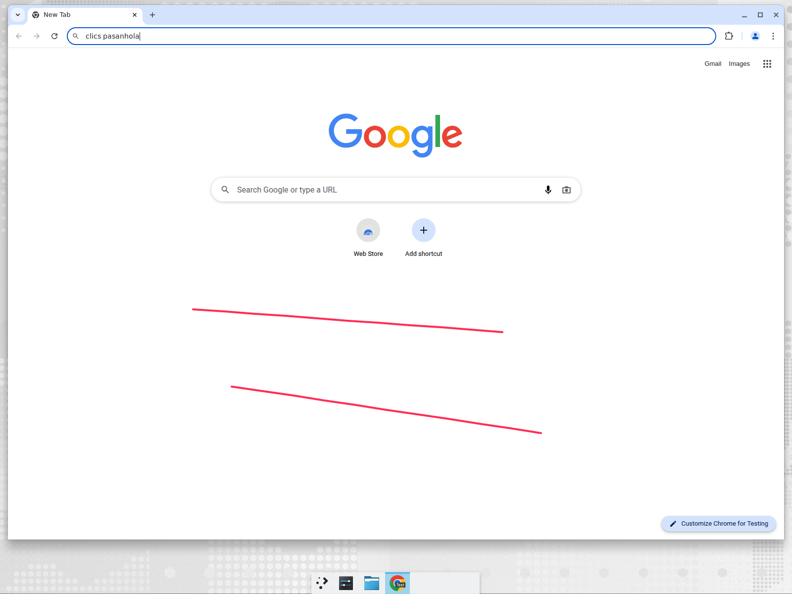

# ScreenMarker

Marcador para **rayar la pantalla** sobre cualquier ventana, pensado para dar clases:
subrayar, señalar elementos, dibujar figuras y resaltar lo que estás explicando sin
importar qué aplicación tengas delante (navegador, terminal, PDF, Zoom, Meet…).

Funciona en **Linux** y **Windows** con el mismo código (Python + PySide6/Qt).



## Qué incluye

- Capa transparente a pantalla completa (multi-monitor) siempre encima del resto.
- Herramientas: **lápiz, resaltador, línea, flecha, rectángulo, elipse, texto,
  borrador y puntero láser** (rastro que se desvanece).
- Paleta de 8 colores + color personalizado, grosor 1–24 y relleno opcional de figuras.
- **Deshacer / rehacer / limpiar** todo.
- **Modo "pasar clics"**: los dibujos siguen visibles pero el mouse vuelve a la
  aplicación de abajo, para seguir trabajando sin cerrar la herramienta.
- **Pizarra** oscura o clara para tapar la pantalla y escribir sobre un fondo limpio.
- **Captura** de la pantalla con las anotaciones incluidas (se guarda en PNG y se copia
  al portapapeles).
- Barra flotante arrastrable y contraíble, y atajos globales de teclado.

## Descargar el ejecutable (sin instalar Python)

En la página de [Releases](https://github.com/arizamoisesco/screenmarker/releases) hay
descargas listas para usar:

- **Windows**: `screenmarker-windows-x64.zip` — descomprímelo (clic derecho →
  *Extraer todo*) y abre `screenmarker.exe` desde la carpeta extraída. No ejecutes la
  aplicación desde dentro del ZIP: Windows la abre en una carpeta temporal y Qt no
  encuentra sus componentes.
- **Linux**: `screenmarker-linux-x86_64` — dale permiso de ejecución y lánzalo:

  ```bash
  chmod +x screenmarker-linux-x86_64
  ./screenmarker-linux-x86_64
  ```

### Aviso de SmartScreen en Windows

El ejecutable no está firmado con un certificado de código (es de pago y se emite a
nombre de una persona u organización), así que Windows muestra *"Windows protegió tu
PC"* la primera vez. Para abrirlo: **Más información → Ejecutar de todas formas**.

Si el antivirus lo bloquea o lo borra, añade la carpeta a las exclusiones de Windows
Defender (*Seguridad de Windows → Protección antivirus → Exclusiones*). Los ejecutables
se compilan en GitHub Actions a partir del código de este repositorio, así que puedes
reconstruirlos tú mismo con PyInstaller si prefieres no confiar en el binario.

### Si el ejecutable no arranca

1. Descarga `screenmarker-windows-x64-debug.zip`, descomprímelo y ejecuta
   `screenmarker-debug.exe`: es la misma aplicación pero con consola, y el error queda
   escrito en pantalla.
2. Cualquier fallo de arranque se guarda también en
   `%LOCALAPPDATA%\ScreenMarker\screenmarker.log` (Linux:
   `~/.local/state/screenmarker/screenmarker.log`).

Los ejecutables los compila GitHub Actions (`.github/workflows/release.yml`) con
PyInstaller cada vez que se publica una etiqueta `vX.Y.Z`.

## Instalación desde el código

Requiere Python 3.10 o superior.

### Linux

```bash
git clone https://github.com/<tu-usuario>/screenmarker.git
cd screenmarker
python3 -m venv .venv && source .venv/bin/activate
pip install -r requirements.txt
python -m screenmarker
```

También puedes usar el script `./run.sh`, que crea el entorno virtual la primera vez.

### Windows

```powershell
git clone https://github.com/<tu-usuario>/screenmarker.git
cd screenmarker
py -m venv .venv
.venv\Scripts\activate
pip install -r requirements.txt
py -m screenmarker
```

O simplemente haz doble clic en `run.bat`.

Para tenerlo siempre a mano puedes crear un acceso directo a `run.bat` (Windows) o a
`run.sh` (Linux) y asignarle un atajo de teclado del sistema.

## Uso

Al iniciar aparece la barra flotante arriba a la derecha (se puede arrastrar desde
cualquier zona vacía y contraer con `–`). Elige una herramienta y dibuja sobre la
pantalla. Cuando necesites volver a usar la aplicación de abajo, pulsa
**Ctrl+Alt+D** (o el botón *Pasar clics*): las anotaciones se quedan pegadas a la
pantalla y el mouse deja de ser capturado. Pulsa otra vez para seguir dibujando.

### Atajos

| Atajo | Acción |
| --- | --- |
| `Ctrl+Alt+D` | Alternar entre dibujar y pasar clics |
| `Esc` | Pasar clics (salir del modo dibujo) |
| `P` / `H` / `L` / `A` | Lápiz / Resaltador / Línea / Flecha |
| `R` / `E` / `T` | Rectángulo / Elipse / Texto |
| `X` / `G` | Borrador / Láser |
| `1`–`8` | Colores de la paleta |
| `[` / `]` | Menos / más grosor |
| `F` | Relleno de figuras |
| `B` o `Ctrl+Alt+B` | Pizarra (apagada → oscura → clara) |
| `Ctrl+Z` / `Ctrl+Y` | Deshacer / rehacer |
| `Ctrl+Alt+C` | Limpiar todo |
| `Ctrl+Alt+S` | Guardar captura con anotaciones |
| `Ctrl+Alt+Q` | Salir |

Los atajos con `Ctrl+Alt` son **globales**: funcionan aunque estés escribiendo en otra
aplicación (requieren el paquete `pynput`, incluido en `requirements.txt`). El resto
funciona cuando ScreenMarker tiene el foco, es decir, en modo dibujo.

Para escribir texto: elige la herramienta *Texto*, haz clic donde quieras escribir,
escribe y pulsa `Enter` (`Esc` cancela).

### Opciones de línea de comandos

```bash
python -m screenmarker --color "#0a84ff" --width 6 --tool arrow --passthrough \
    --screenshot-dir ~/Capturas
```

## Notas por sistema

- **Linux**: el modo "pasar clics" usa la extensión XShape de X11 y la transparencia
  necesita un compositor activo (KDE, GNOME, XFCE con compositing, etc.). En sesiones
  **Wayland** ejecuta la herramienta sobre XWayland:
  `QT_QPA_PLATFORM=xcb python -m screenmarker`.
- **Windows**: no necesita configuración extra; el modo "pasar clics" usa el estilo
  `WS_EX_TRANSPARENT` de la API Win32.
- Las capturas se guardan por defecto en `~/Pictures/ScreenMarker`
  (`%USERPROFILE%\Pictures\ScreenMarker` en Windows).

## Desarrollo

```bash
pip install -r requirements-dev.txt
ruff check .
QT_QPA_PLATFORM=offscreen pytest
```

Estructura del paquete:

| Archivo | Contenido |
| --- | --- |
| `screenmarker/app.py` | Arranque, atajos y conexión entre barra y lienzo |
| `screenmarker/overlay.py` | Ventana transparente, eventos de mouse y capturas |
| `screenmarker/toolbar.py` | Barra flotante de herramientas |
| `screenmarker/model.py` | Anotaciones (geometría, dibujado, detección para borrar) |
| `screenmarker/passthrough.py` | Click-through nativo en X11 y Win32 |
| `screenmarker/hotkeys.py` | Atajos globales opcionales con `pynput` |
